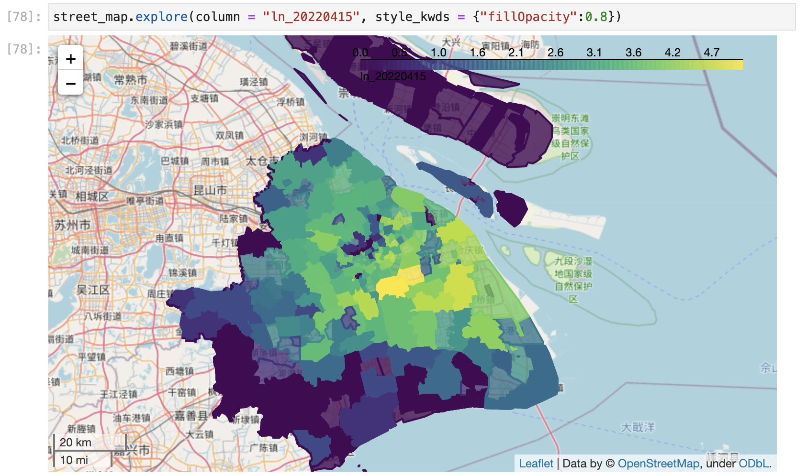

# Shanghai-COVID-2022

Data Sharing Portal - 半自动化的上海疫情数据更新工具，包括市级数据，区级数据，地址数据，每天只需要五分钟即可更新。
清理完毕的数据在 data/use/里

该项目是2020年疫情数据开放小组[Glacier Data](https://github.com/Glacier-Ice/Covid-19-data-science)及其讨论的继承项目。

最新的工作流见[Notion链接](https://stockard-halfway.notion.site/9aace6bd589c490f8015f98d87ea735f?v=7b2a1b31be1a469d9f373e1cb0e59f0d)

# 工作进度

- 数据获取和预处理 - 完工
- 数据清洗
    - [ ]  街道级别合并
    - [ ]  地址级别合并，新增地址标记
- 数据呈现
    - [ ]  街道数据可视化效果
    - [ ]  新增数据及关键指标
    - [ ]  疫情意外因子研究
    - [ ]  政策时间线
    - [ ]  时光机器：切片显示过去几天的地图/差异图
    - [ ]  街道阳性率变化
    - [ ]  社区和路网
- 部署
    - [ ]  Github Workflow
    - [ ]  技术方案研究

# 使用方法
1. 申请高德key 写入 keys.py # keys.py 没有在目录里，定义gaode_ak, 防止key暴露
2. python src/fetch/crawl_official.py
   会生成卫健委的文件，但中间有一步需要手动 - 根据显示的微信文章地址把文章数据贴在最新几天的文件里。 -> raw/data/address 
3. python src/fetch/update.py

# Tableau Viz

[点击查看](https://public.tableau.com/app/profile/stockard.feng/viz/_16494860765160/1)

# 项目整体框架

项目的目的在于提高上海数据的可见性。 此外，上海疫情发展要看每个街道和小区层面的处理，下一步是街道和小区路网的可视化。

三月初上海的精准防疫建立在应测尽测，阳性闭环管理基础上。
**三月初防疫中漏掉的地区可能是系统性的遗漏，并不完全代表精准防疫的失败。** 而且目前疫情的来源也多半是这些遗漏的地区。

# Github上的项目链接
[疫情发布会通知](https://github.com/liurenjie520/Shanghai_COVID-19_Push)
[生活必需品词库](https://github.com/xuanskyer/shanghai_covid_19_goods)
[疫情数据分析](https://github.com/kekincai/shanghai_covid19)
[疫情地址viz](https://github.com/Xenofex/covid-shanghai-viz)
[各类疫情记录](https://github.com/000fan000/covid19-shanghai2022)

#其他
[上海生活指南](https://www.wolai.com/6TLbKJYT1JTq3cFqXTWVXC)

People lie and forget and rewrite, but data never lies nor forgets.
仅为记录，以守为攻
